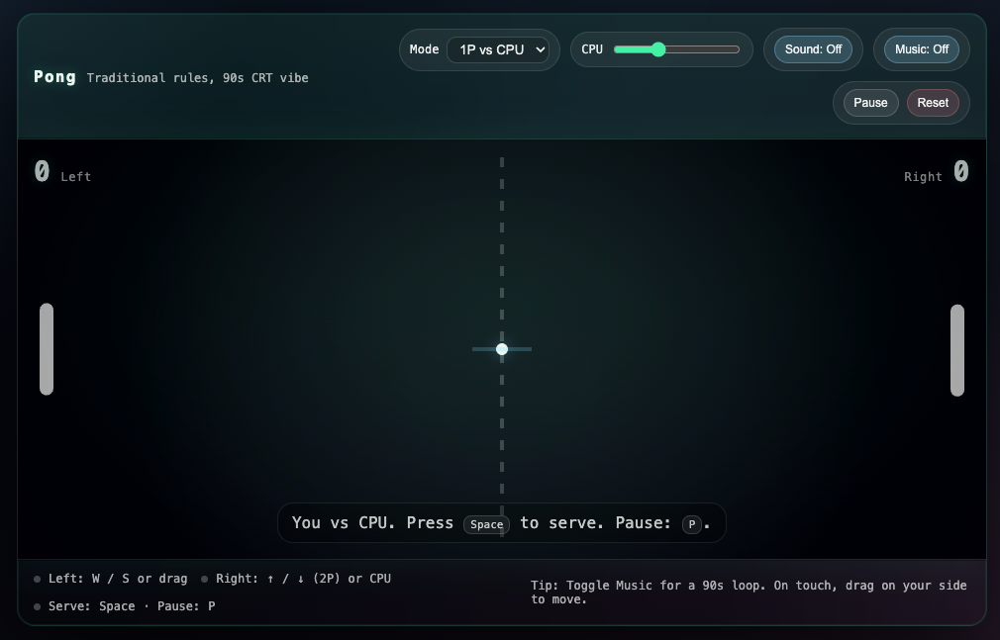

# Pong (single-page, 90s CRT vibe)

Traditional Pong gameplay in a single `index.html` with a modern glass UI and optional retro synth loop.

## Play

- **Run locally:** open `index.html` in your browser.
  - For best results on some browsers, serve it locally: `python3 -m http.server` then open `http://localhost:8000`.
- **Play online:** you can also try it directly from github here:
  - https://rawcdn.githack.com/MortenGuld/pong/d39fc46310444cf836d7616f994622b93325eda0/index.html

## Controls

- **Left paddle:** `W` / `S` or drag on the left half of the playfield
- **Right paddle:** `↑` / `↓` in **2P local** mode (or drag on the right half)
- **Serve / restart:** `Space` (or tap/drag on touch)
- **Pause:** `P` (or the Pause/Resume button)
- **First to 11** wins

## Settings

- **Mode:** 1P vs CPU or 2P local
- **CPU:** difficulty slider (1 = easiest)
- **Sound:** retro beeps for hits/walls/score (requires a click to enable)
- **Music:** background synth loop (requires a click to enable)

## Notes

- This game is VIBE coded — ~30 minutes effort, tops.
- Replace `assets/screenshot.svg` with your own screenshot if you want a real capture in the README.
